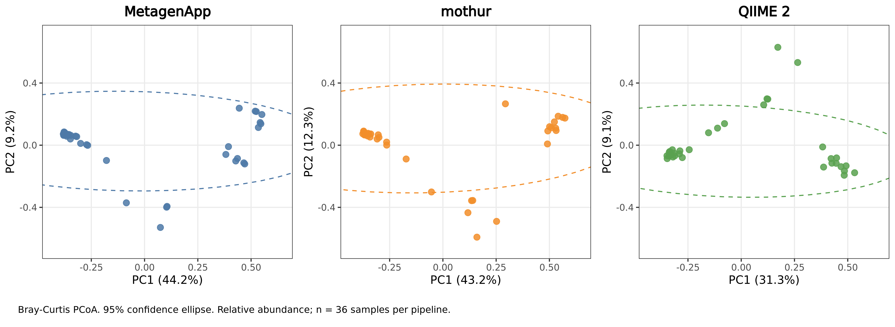

# MetagenApp

**MetagenApp** is a reproducible 16S/18S metabarcoding pipeline that turns
paired-end Illumina reads into taxonomically annotated OTU tables. It is built
around a Wang-style k-mer classifier (`naive-v2`) and VSEARCH, and is designed
to run quickly and with modest memory on standard hardware.

Developed by José Mijail Campos Compeán (Universidad Autónoma Metropolitana, Mexico).
A web interface built on this pipeline is available at **[demo.bioagens.com](https://demo.bioagens.com)**.

---

## Benchmark: MetagenApp vs mothur vs QIIME 2 (v2, ECCB 2026)

Presented at **ECCB 2026** (Geneva, poster A-B.05):
*"Impact of bioinformatic pipeline selection on microbial community inference:
a comparative analysis across pipelines including MetagenApp"*
— [poster PDF](docs/ECCB2026_poster.pdf).

**Design.** 36 paired-end MiSeq 16S V3–V4 samples (pharyngeal and nasal;
González-García et al. 2024), 1.52 M raw reads. All three pipelines used the
same anchored 341F/805R primer trimming (cutadapt) and the same curated
SILVA 138.2 NR99 reference. MetagenApp and mothur cluster at 97% similarity;
QIIME 2 infers ASVs with DADA2. Each pipeline was run in isolation on the same
hardware (16 threads). Alpha diversity was rarefied to 1,414 reads/sample.

### Key results

- **Biological signal dominates the pipeline effect.** In a combined
  PERMANOVA (Bray–Curtis, phylum level, 9,999 permutations), sample identity
  explains **88.9%** of the variance and pipeline choice **1.9%**
  (both p < 0.001); dispersion does not differ between pipelines
  (betadisper p = 0.90).
- **High inter-pipeline concordance.** Mantel r = 0.94 for all three pairwise
  comparisons (p < 0.001).
- **Pipeline effects on alpha diversity are metric-dependent.** Richness and
  Chao1 differ between all pipelines (Friedman + Holm-corrected Wilcoxon);
  Shannon diversity does not differ between MetagenApp and QIIME 2
  (adjusted p = 0.27).
- **Lower computational cost.** MetagenApp ran ~9.7× faster than mothur with
  ~5× less peak memory.



| | MetagenApp | mothur | QIIME 2 |
|---|---|---|---|
| Feature inference | VSEARCH, 97% OTUs | OptiClust, 97% OTUs | DADA2 ASVs |
| Final features | 12,599 OTUs | 7,552 OTUs | 1,332 ASVs |
| Reads retained (final table / raw) | 69.9% | 68.2% | 66.5% |
| Wall-clock time | **14 min 55 s** | 2 h 24 min | 20 min 43 s |
| Peak memory | **6.8 GB** | 33.8 GB | 14.1 GB |
| Median observed richness (rarefied) | 122 | 83 | 104 |
| Median Shannon (rarefied) | 3.09 | 2.87 | 3.41 |

Phylum-level composition is broadly conserved across pipelines, and
unclassified reads stay below 0.5% for all three.

**Limitations.** Richness estimates are the most pipeline-sensitive metric,
with MetagenApp producing more features than mothur or QIIME 2. The next step
is to evaluate ASV-style inference in MetagenApp to test whether richness
inflation can be reduced while keeping its efficiency.

Summary statistics and PCoA coordinates are in [`results_v2/tables/`](results_v2/tables/).

---
## Features

- Custom classifier (`naive-v2`) — Wang-style bootstrap k-mer confidence scoring
- SILVA NR99 models (138 on Zenodo; 138.2 used in the v2 benchmark)
- Alignment fallback — EDLib pairwise alignment for borderline sequences (94% threshold, Yarza et al. 2014)
- Optional primer trimming (`--primer-f` / `--primer-r`, cutadapt)
- Accepts `.fastq`/`.fq` input, plain or gzipped
- 26-step pipeline — merge → filter → cluster → classify → OTU table
- Multiple execution modes: `student`, `premium`, `turbo`, `ref`, `qa`
- Modern CLI with configurable profiles

---

## Installation

### Requirements

- [Conda](https://docs.conda.io/en/latest/miniconda.html) (Miniconda or Anaconda)

### Install

```bash
git clone https://github.com/mijailcampos/metagenapp
cd metagenapp
conda env create -f environment.yml
conda activate metagenapp
python download_model.py
```

`conda env create` installs all tools and Python dependencies in one step, including `vsearch`, `mafft`, `edlib`, and the `metagenapp` package itself.

`download_model.py` downloads the SILVA v1 classifier (~2.3 GB) from Zenodo ([10.5281/zenodo.20076968](https://doi.org/10.5281/zenodo.20076968)) into `~/.metagenapp/refs/`.

To use a custom model path:

```bash
python download_model.py --dest /path/to/refs
export METAGENAPP_REFS=/path/to/refs  # add to ~/.bashrc
```

### Disk space

| Component | Size |
|---|---|
| Repository | ~20 MB |
| Conda environment | ~2–3 GB |
| SILVA v1 model (Zenodo) | ~2.3 GB |
| SILVA reference sequences | ~22 MB |
| **Total** | **~5 GB** |

### Platform support

| Platform | Support |
|---|---|
| Linux | Full |
| macOS | Full |
| Windows | Requires WSL2 (vsearch has no native Windows binary) |

---

## Quick start

```bash
# Run on example data (3 samples, ~20k reads each)
metagenapp -i example_data/ -o results/ --threads 4 --mode ref

# Full run with a profile (auto-generates timestamped output directory)
metagenapp --profile ref --input /path/to/fastq/

# Resume from a specific step
metagenapp -i data/ -o results/ --from-step clasificacion_tax
```

---

## Pipeline overview

26 sequential steps, from paired FASTQ to OTU table with taxonomy:

```
FASTQ R1 + R2
    ↓ [01] Merge paired reads (VSEARCH mergepairs)
    ↓ [02] Quality filter (length, ambiguities)
    ↓ [03] Dereplicate + count per sample
    ↓ [04] Reference alignment (VSEARCH, 70% identity)
    ↓ [09] Trim region of interest
    ↓ [10] Cluster at 97% → centroids + UC file
    ↓ [11] Extract centroids (mode-dependent)
    ↓ [12–18] MAFFT alignment + chimera removal (student/premium/turbo)
    ↓ [20] Taxonomic classification  ←  core step
    ↓ [21] Remove non-target lineages (chloroplasts, mitochondria)
    ↓ [22–26] OTU table (per sample, merged)
```

### Execution modes

| Mode | Description |
|---|---|
| `ref` | Publication grade — EDLib alignment, no MAFFT |
| `premium` | Balanced — MAFFT alignment |
| `turbo` | Max speed — no alignment |
| `student` | Low resource — 10,000 centroid cap |
| `qa` | Quality control only |

---

## Classifier: naive-v2

Wang-style bootstrap confidence scoring over a k-mer inverted index.

1. Extract k-mers from query sequence
2. Discard k-mers with `psize >= 20` (too generic)
3. Sum k-mer weights per taxon at each taxonomic level
4. Bootstrap (100 iterations): resample k-mer pool → vote
5. Assign deepest level with confidence >= 0.60

**Model (v1.0):** SILVA 138 NR99, 83,000 taxa, confidence threshold 0.60.

---

## Repository structure

```
metagenapp/
├── metagenapp/           # CLI and pipeline orchestration
│   ├── cli/main.py       # Entry point (Typer)
│   ├── pipeline/         # 26-step pipeline modules
│   └── metagen_config.py # Global config and paths
├── metagenapp_core/      # Classification engines
│   ├── models/           # naive-v2, kraken-lite
│   └── utils/            # k-mer generation, LCA
├── scripts/              # Paper figures and model training
│   ├── Figure*.R         # Benchmark figures
│   ├── train_naive_v2.py # Train a new naive-v2 model
│   ├── build_silva_trainset.py
│   └── dev/              # Internal / experimental scripts
├── results_v2/           # Benchmark v2 (ECCB 2026): figure + summary tables
├── docs/                 # ECCB 2026 poster
├── results_v1/           # Benchmark v1.0 (superseded, see below)
│   ├── tables/           # TSV tables (OTU, taxonomy, resources)
│   ├── figures/          # PDF/PNG figures
│   ├── logs/             # /usr/bin/time -v timing logs
│   ├── raw_outputs/      # Pipeline outputs (MetagenApp, Mothur, QIIME 2)
│   └── COMMIT_HASH.txt   # Exact commit and command used
├── example_data/         # 3 public 16S samples for testing (~20k reads)
├── requirements.txt
├── pyproject.toml
├── VERSION.txt
└── LICENSE
```

---

## Reproducing the benchmark

### v2 (ECCB 2026)

MetagenApp command used in the v2 benchmark:

```bash
metagenapp -i <fastq_dir> -o <out_dir> \
  --mode ref --marker 16S --classifier naive-v2 --model-type silva \
  --primer-f CCTACGGGNGGCWGCAG --primer-r GACTACHVGGGTATCTAATCC \
  --min-length 400 --max-length 440 --max-ambigs 0 --max-poly 8 -t 16
```

The v2 benchmark used a `naive-v2` model trained on **SILVA 138.2 NR99**
(Bacteria, Archaea and Eukaryota; minimum length 900/1200/1400 bp per domain,
≤5 degenerate bases, homopolymers ≤8, as in QIIME 2's RESCRIPt workflow), built
with `scripts/build_silva_trainset.py` and `scripts/train_naive_v2.py`.
This model is not yet on Zenodo (the current Zenodo
release is the SILVA 138 model); it is available on request and will be
published in a new Zenodo version. The mothur and QIIME 2 scripts and
the raw outputs are also available on request.

### v1.0 (superseded)

The first benchmark (tag [`v1.0`](https://github.com/mijailcampos/metagenapp/releases/tag/v1.0),
[`results_v1/`](results_v1/)) ran QIIME 2 without primer trimming, which
reduced its read retention (12.6%) and made the comparison unfair to QIIME 2.
It is kept for transparency and is superseded by the v2 benchmark above,
where all three pipelines share the same primer trimming and reference.

---

## Citation

> Campos Compeán, J.M. (2026). Impact of bioinformatic pipeline selection on
> microbial community inference: a comparative analysis across pipelines
> including MetagenApp. Poster A-B.05, ECCB 2026, Geneva.

A full manuscript is in preparation.

---

## License

MIT — see [LICENSE](LICENSE).
